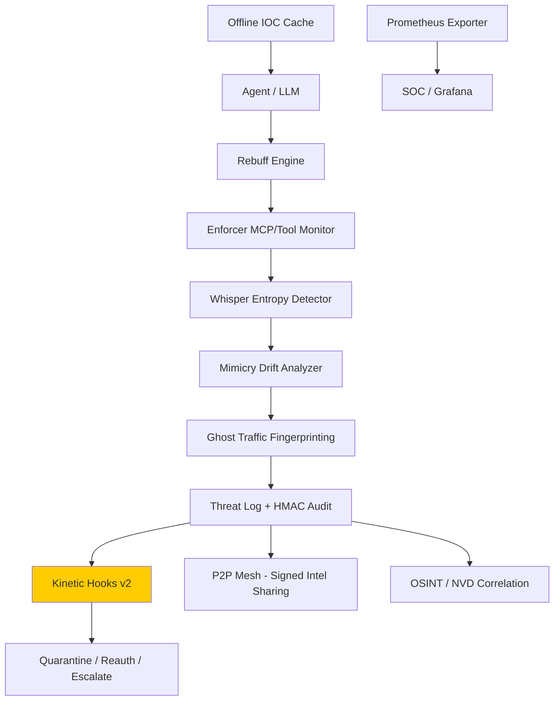

# DARKSPACE by Fratres X AI

Passive, auditable cybersecurity intelligence platform.



---

## Architecture

| File | Role |
|---|---|
| `app.py` | Streamlit dashboard (**demo mode only**, not part of hardened headless core package) |
| `enforcer.py` | Passive MCP/tool-call signature monitor + rate-based detector |
| `osint_expert.py` | NVD CVE feed ingestion + cross-reference with threat log |
| `rebuff_engine.py` | Prompt-injection shield — detect & log hostile instructions |
| `ghost_monitor.py` | Encrypted-traffic fingerprinting via timing/length analysis (passive) |
| `vault_guardian.py` | Alert-driven mock credential-rotation workflow |
| `p2p_mesh.py` | Signed threat-intel sync across trusted DARKSPACE nodes |
| `whisper_detector.py` | Shannon entropy analysis for steganography detection |
| `mimicry_hunter.py` | TF-IDF cosine-distance behavioral drift analyzer |
| `neural_mirror.py` | Offline red-team simulation harness |
| `config.py` | Central configuration — all tunable thresholds and paths |

All detection events are written to **`audit_log.db`** (SQLite) with SHA-256 payload hashes and HMAC-SHA256 signatures for chain-of-custody.

---

## Requirements

- Python 3.11+
- No root / admin privileges required for most modules
  - `ghost_monitor.py` live mode uses `psutil` only (no raw sockets)
  - `ghost_monitor.py --pcap` mode optionally uses `scapy` (read-only)

---

## Installation

```bash
# 1. Create and activate a virtual environment
python -m venv .venv

# Windows
.venv\Scripts\activate

# macOS / Linux
source .venv/bin/activate

# 2. Install core (headless) dependencies
pip install -r requirements.txt

# 3. Optional: install demo dashboard dependencies
pip install -r requirements-demo.txt
```

---

## Configuration

### Option A — Environment variables (recommended)

```bash
# Required for ThreatFox live feed
set THREATFOX_API_KEY=your_key_here          # Windows
export THREATFOX_API_KEY=your_key_here       # macOS/Linux

# Optional — override DB path and HMAC secret
set DARKSPACE_DB_PATH=audit_log.db
set DARKSPACE_HMAC_SECRET=change_me_in_production
```

### Option B — `.env` file

Create a `.env` file in the project root (never commit it):

```
THREATFOX_API_KEY=your_key_here
DARKSPACE_HMAC_SECRET=change_me_in_production
```

Then load it before running:

```bash
python -c "from dotenv import load_dotenv; load_dotenv()"
```

### Option C — Streamlit secrets (for `app.py` only)

```bash
copy .streamlit\secrets.toml.example .streamlit\secrets.toml
# Edit secrets.toml and add your ThreatFox API key
```

> **ThreatFox API key**: Register free at https://threatfox.abuse.ch/api/

---

## Running each module

### Dashboard (demo mode only)
```bash
streamlit run app.py
```
Opens at `http://localhost:8501`

For submission/hardened deployment, treat the dashboard as an optional demo artifact and run the core modules headlessly (CLI + k8s deployment path).

### Enforcer — passive monitor (pipe log output into it)
```bash
# From stdin
echo '{"tool": "read_file", "args": {}}' | python enforcer.py

# From a log file
python enforcer.py --file path/to/app.log

# Verbose mode
python enforcer.py --verbose
```

### OSINT Expert — CVE feed sync
```bash
# Run once (last 1 day of CVEs)
python osint_expert.py

# Continuous loop, refresh every 30 min
python osint_expert.py --loop --days 1 --verbose
```

### Rebuff Engine — prompt injection shield
```bash
# Interactive mode
python rebuff_engine.py

# Single check
python rebuff_engine.py --check "Ignore all previous instructions"
```

### Ghost Monitor — traffic fingerprinting
```bash
# Live psutil sampling (no root needed)
python ghost_monitor.py

# Analyse a .pcap file (requires: pip install scapy)
python ghost_monitor.py --pcap capture.pcap
```

### Vault Guardian — mock key rotation
```bash
# Continuous loop (checks every 30 s)
python vault_guardian.py

# Single check and exit
python vault_guardian.py --once
```

### P2P Mesh — threat-intel sync
```bash
# Start listener + sync loop (add peers in config.py → P2P_PEERS)
python p2p_mesh.py

# One-shot push to peers
python p2p_mesh.py --push-only

# Custom port
python p2p_mesh.py --port 9001
```

### Whisper Detector — steganography check
```bash
# Interactive
python whisper_detector.py

# Single string
python whisper_detector.py --text "SGVsbG8gV29ybGQ="

# File (one message per line)
python whisper_detector.py --file messages.txt
```

### Mimicry Hunter — behavioral drift
```bash
# Interactive
python mimicry_hunter.py

# Seed baseline from file
python mimicry_hunter.py --baseline approved_prompts.txt
```

### Neural Mirror — red-team simulation
```bash
# Run all synthetic samples
python neural_mirror.py

# Run first 10 samples, verbose
python neural_mirror.py --samples 10 --verbose

# Run extended 220+ corpus profile
python neural_mirror.py --profile extended --samples 220
```

---

## Key thresholds (all tunable in `config.py`)

| Setting | Default | Meaning |
|---|---|---|
| `ENFORCER_RATE_THRESHOLD` | 10 | Events per window before rate alert |
| `ENFORCER_RATE_WINDOW_SECONDS` | 60 | Sliding window for rate detection |
| `VAULT_CRITICAL_SCORE_THRESHOLD` | 8.0 | Risk score that triggers mock rotation |
| `WHISPER_ENTROPY_THRESHOLD` | 3.5 | bits/char above which text is flagged |
| `MIMICRY_DRIFT_THRESHOLD` | 0.8 | Cosine distance above which drift is flagged |
| `NEURAL_MIRROR_SAMPLE_LIMIT` | 42 | Max synthetic samples per red-team run |

---

## Safety guarantees

- **No TCP resets** — zero raw socket writes
- **No active blocking** — observation and logging only
- **No payload decryption** — traffic analysis uses timing/size only
- **No offensive probing** — all network calls are read-only GET/POST to approved public APIs
- **No credential mutation** — vault rotation is mock-only
- **Audit chain** — every detection is hashed (SHA-256) and HMAC-signed before storage

---

## Database tables

| Table | Written by | Contents |
|---|---|---|
| `audit_log` | `app.py` | ThreatFox search results, IOC records |
| `threat_log` | `enforcer.py` | Signature & rate detections with HMAC sigs |
| `vuln_log` | `osint_expert.py` | NVD CVEs |
| `vuln_correlation` | `osint_expert.py` | CVE ↔ threat_log cross-references |
| `prompt_log` | `rebuff_engine.py` | Prompt attempt hashes + verdicts |
| `ghost_log` | `ghost_monitor.py` | Traffic timing/size metrics |
| `vault_events` | `vault_guardian.py` | Mock rotation records |
| `mesh_inbox` | `p2p_mesh.py` | Inbound peer intel summaries |
| `whisper_log` | `whisper_detector.py` | Entropy scores |
| `mimicry_log` | `mimicry_hunter.py` | Drift scores |
| `mirror_results` | `neural_mirror.py` | Red-team run results |

---

## 4. Gaps & Risk Areas (Honest assessment - this is why we still do PoCs)

- **No active response layer yet (v1.0 is deliberately passive).**
  - Acceptable for initial evaluation, but **v2 must include kinetic hooks** (auto-quarantine of agent session, forced re-auth, etc.).
  - Status: `kinetic_hooks.py` and the `Kinetic Hooks` dashboard tab provide this v2 response path; validate in deployment with dry-run first.

- **P2P Mesh trust model**
  - Current design assumes pre-vetted peers.
  - In a real deployment we would want **PKI + mutual TLS + zero-trust attestation** (e.g., via SPIFFE).

- **False-positive tuning**
  - Entropy thresholds and drift thresholds are good starting points but will need empirical calibration against real `.mil` agent traffic.

- **Streamlit dashboard**
  - Convenient for demo, but not suitable for classified environments.
  - We would containerize the backend and replace the frontend with a hardened DoD-approved web framework or a thick-client.

- **ThreatFox dependency**
  - Fine for unclass, but operational nodes should have an offline IOC cache or integration with classified feeds (e.g., ACES, CYBERCOM feeds).
  - Status: local SQLite IOC caching exists; classified-feed integration remains a deployment-phase integration task.

- **Neural Mirror realism limits**
  - Current 100% scores (including `220/220`) are on synthetic/red-team-generated corpus data.
  - Real-world adversarial traffic is expected to expose additional gaps that require continuous corpus and rule updates.

- **Kinetic hooks are partially integrated**
  - `kinetic_hooks.py` supports real wiring via optional Keycloak integration, but most deployment actions remain environment-specific integration work.
  - Production rollout still requires mission IdP/SIEM-specific implementation and runbook validation.

- **Demo UI still exists in repo**
  - Streamlit dashboard is explicitly demo-only and split from headless core dependencies.
  - Its presence is for demonstrations and operator exploration, not classified production deployment.

- **Static-analysis residual noise**
  - Bandit medium/high blockers are enforced to zero.
  - Remaining Bandit findings are expected low-severity patterns (for example, assert/test/tooling noise) and are tracked as residual risk.

---

## DevSecOps & Compliance Baseline

- CI security workflow: `.github/workflows/security-ci.yml`
  - Regression/compliance smoke suite (`python _smoke_v2.py`)
  - SAST (`bandit`, `semgrep`)
  - SCA (`pip-audit`)
  - SBOM generation (CycloneDX on CI runs, SPDX via Syft on releases)
  - Release provenance signing via Sigstore Cosign (keyless/OIDC)
- Security disclosure and supply-chain posture: `SECURITY.md`
- NIST AI RMF + maturity mapping: `MATURITY.md`
- Configuration versioning and threshold history: `CHANGELOG_CONFIG.md`

### Run security checks locally

```bash
pip install bandit pip-audit semgrep cyclonedx-bom pytest prometheus-client
python _smoke_v2.py
python -m pytest -q tests/test_core_security.py
bandit -q -r . -x .venv,__pycache__
semgrep --config=p/ci --error
pip-audit --strict
cyclonedx-py requirements --output-file sbom.cdx.json --output-format json requirements.txt
```

### Test suite (pytest)

- Core security regression tests: `tests/test_core_security.py`

Run directly:

```bash
python -m pytest -q tests/test_core_security.py
```

### SBOM artifacts

- CycloneDX SBOM: `sbom.cdx.json`
- SPDX SBOM: `sbom.spdx.json`

Generate both formats locally:

```bash
cyclonedx-py requirements --output-file sbom.cdx.json --output-format json requirements.txt
syft dir:. -o spdx-json=sbom.spdx.json
```

Remaining Bandit noise is low-severity/expected test/tooling patterns, not medium/high risk blockers.

### Hardened container deployment

- OCI image definition: `Dockerfile`
  - Non-root runtime user
  - Minimal Python base image
- Kubernetes baseline manifests: `k8s/darkspace-deployment.yaml`
  - `runAsNonRoot`, dropped Linux capabilities
  - `readOnlyRootFilesystem`
  - `seccompProfile: RuntimeDefault`

### Baseline security configuration

Set these for production deployments:

```bash
set DARKSPACE_HMAC_SECRET=<32+ byte random secret>
set DARKSPACE_P2P_REQUIRE_MUTUAL_AUTH=true
set DARKSPACE_PEER_FINGERPRINTS=<sha256fp1>,<sha256fp2>
```

`config.enforce_security_baseline()` now blocks runtime startup when minimum baselines are not met.

### Air-gapped operation controls

- Global offline switch: `DARKSPACE_OFFLINE_ONLY=true`
- `osint_expert.py` supports `--offline-only`
- `app.py` ThreatFox fetch/search now respects offline-only mode and uses local IOC cache
- Default posture is offline-first (`DARKSPACE_OFFLINE_ONLY=true` when unset)

Pre-seed IOC cache before disconnected operation:

```bash
python preseed_ioc_cache.py --input ioc_seed.json
```

`ioc_seed.json` should be a JSON array of objects with fields such as:
`ioc`, `ioc_type`, `threat_type`, `malware_printable`, `confidence_level`, `reporter`, `raw_json`.

### IdP integration example

- Concrete Keycloak admin integration example: `contrib/keycloak_idp_example.py`
- Intended for deployment glue with `kinetic_hooks.py` quarantine/re-auth action points

### SOC export roadmap

- Current: SQLite-backed `Security Metrics` tab in Streamlit
- Added starter exporter: `export_security_metrics_prometheus.py`
- Added Grafana starter dashboard: `grafana/darkspace_security_metrics_dashboard.json`

Run Prometheus exporter:

```bash
python export_security_metrics_prometheus.py --port 9109 --interval 15
```

Metrics are exposed at `http://localhost:9109/metrics` for Prometheus scrape integration.

## DoD pre-escalation checklist status

### Must-have (non-negotiable)

- Runtime security baseline enforcement: complete (`config.enforce_security_baseline()`)
- Kinetic safety controls (dry-run + toggles + audit): complete
- Neural Mirror validation gate (`>=97%` target): complete
- Calibration with audit trail (`calibrate.py`): complete
- SBOM generation at release (CycloneDX + SPDX): complete
- Structured metrics and observability: complete
- P2P zero-trust controls (mTLS + attestation + fingerprint allowlist): complete
- Hardcoded-secret checks in smoke suite: complete

### Strongly recommended (before escalation)

- Explicit CMMC/DFARS mapping in `MATURITY.md`: complete
- Concrete IdP integration example in `contrib/`: complete (`contrib/keycloak_idp_example.py`)
- NSA AISC alignment notes in `SECURITY.md`: complete
- Sigstore provenance in CI (`.github/workflows/security-ci.yml`): complete
- Application Security STIG full verification with official DISA tooling: pending external validation step (requires STIG Viewer/SCAP content in target environment)
